# session-card

**A status card at the end of every Claude Code turn: what's done, what you need to do, and what Claude does next.**

Long chat scrollback is hard to scan, especially when you have several sessions going or you have ADHD. With this plugin, every turn ends with a small colour-coded card. You can tell where the session is at a glance, and answer questions from the card, without reading back through the chat.

<p align="center">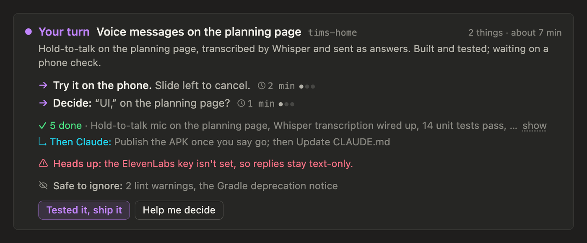</p>

## Install

In Claude Code, run:

```
/plugin marketplace add timoconnellaus/session-card
/plugin install session-card@session-card
```

Then restart Claude Code, or start a new session. There's nothing to configure.

**Where it works:** the Claude desktop app (Code tab), claude.ai and mobile, which can draw inline widgets. In a plain terminal the plugin stays out of the way and nothing changes.

## Using it

1. **Work as usual.** At the end of each turn, Claude adds a card as the last thing in the reply.
2. **Read the card from the top.** The header names the session and says what it's about, so you know which one you're looking at. The coloured banner says whose turn it is. The sections below list what's done, what's yours, and what Claude does next.
3. **Answer from the card.** Buttons and questions put a ready-written reply into your message box, each on its own line. Change it if you like, then press Enter to send. You can press a button again, or combine several.

The colours always mean the same thing:

| Colour | Means |
|---|---|
| Violet | Your turn: something to try, decide or approve |
| Rose | Blocked, or seen failing |
| Cyan | What Claude does next |
| Green | Done and checked in this session |
| Grey | Not started, unknown or stale |

Cards follow your light or dark theme and fit phone screens.

<p align="center">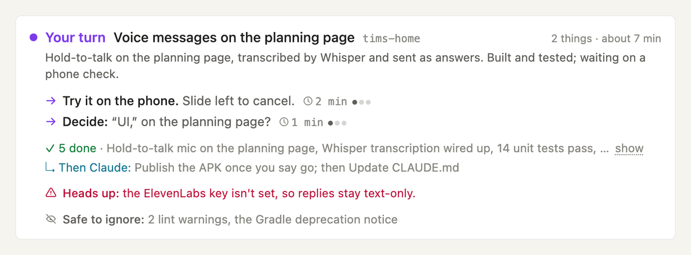 &nbsp; 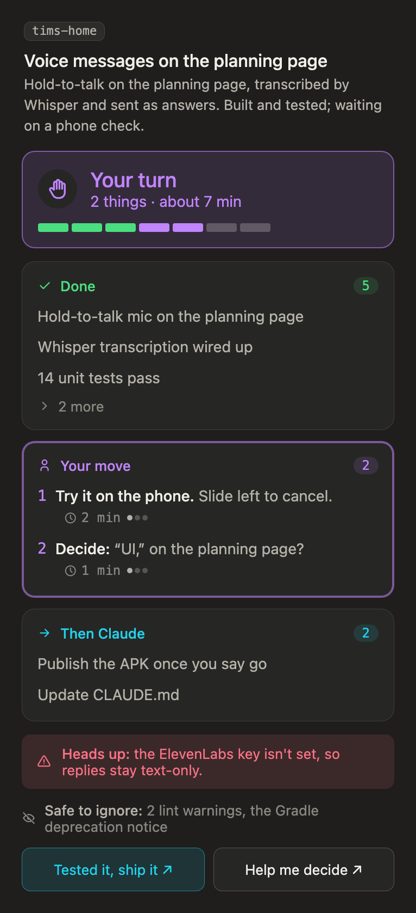</p>

## What a card can show

Claude builds each card from a kit of blocks and picks the ones that fit the moment. Here are the common shapes.

### Back from a break

Where you left off, the one next step with a quick checklist, progress since you last looked, and whether it's safe to stop.

<p align="center">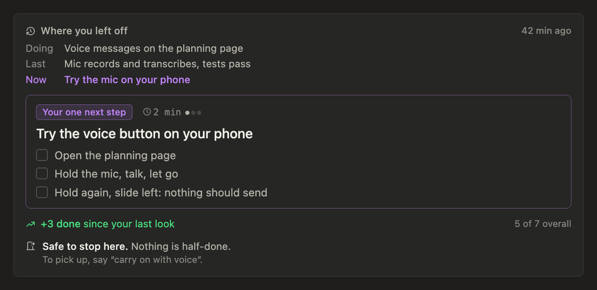</p>

### Progress

A vertical stepper with "you are here", and a count of what's on whom.

<p align="center">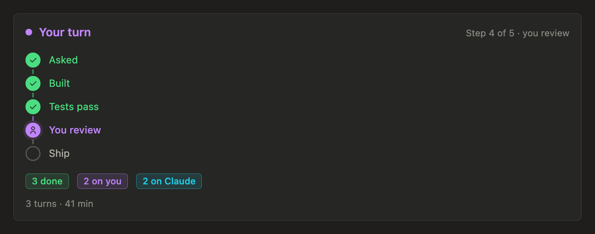</p>

### Lots of items

Counts at the top, then one list with your items first. Each item can have its own answer button, and commands to run come with a copy button.

<p align="center">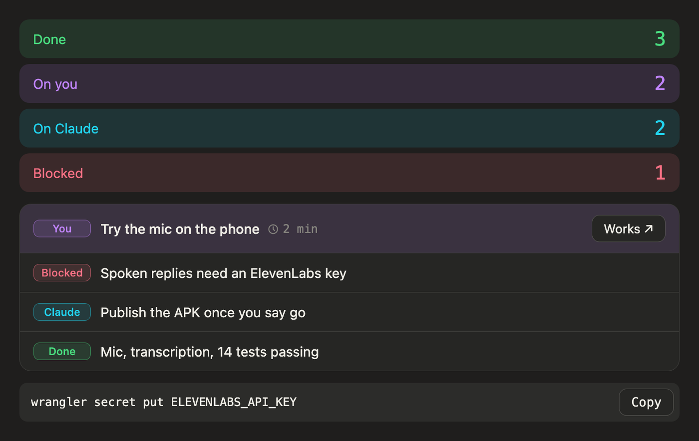</p>

### Ship check

The git state (branch, ahead and behind, uncommitted changes, merged or not), the pull request, a ship gate of checks, and what's live where. Checks that weren't run, or ran before the last edit, show as their own grey states instead of quietly counting as passed.

<p align="center">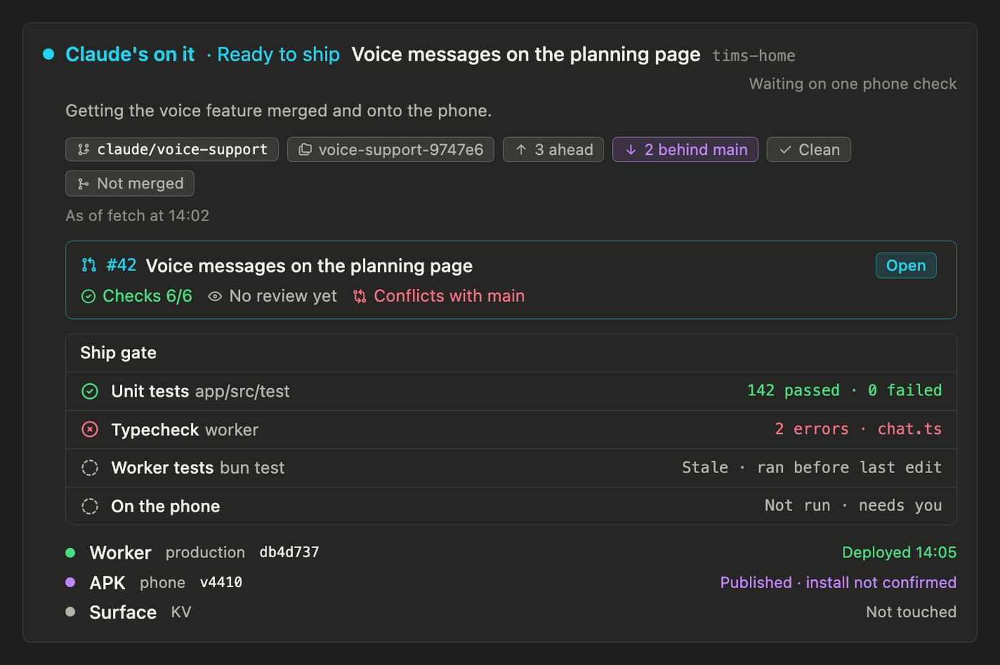</p>

### Ready for review

What changed, how we know it works (observed, tested, inferred or unchecked), and the risk with a rollback command you can copy.

<p align="center">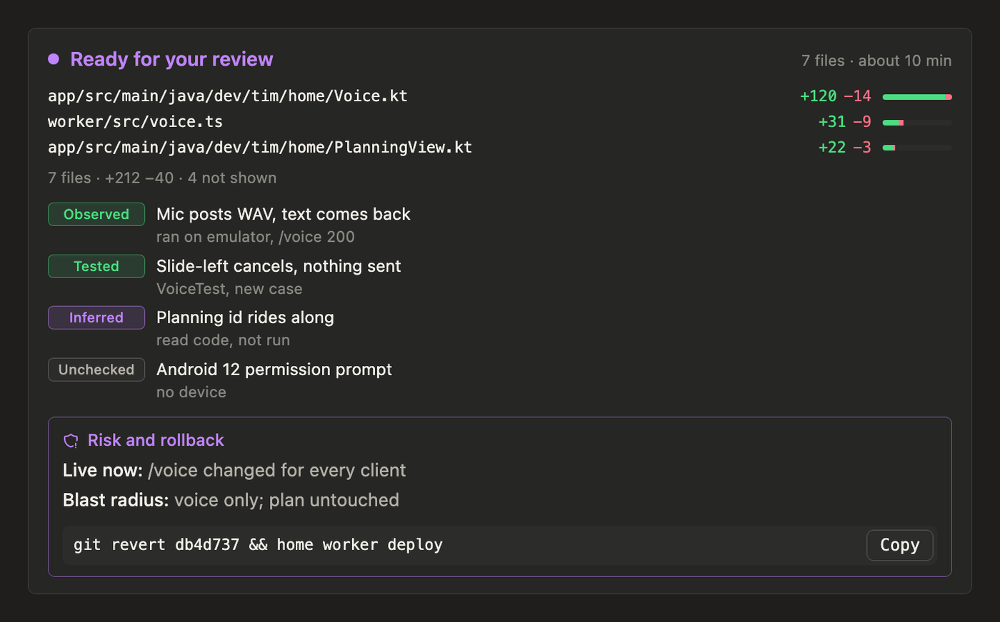</p>

### Questions

A decision with Claude's recommendation already selected, a batch of yes/no/later questions, and approve-with-a-tweak. Everything goes into one reply, with a preview of exactly what will be sent. **Reset to defaults** puts back Claude's picks.

<p align="center">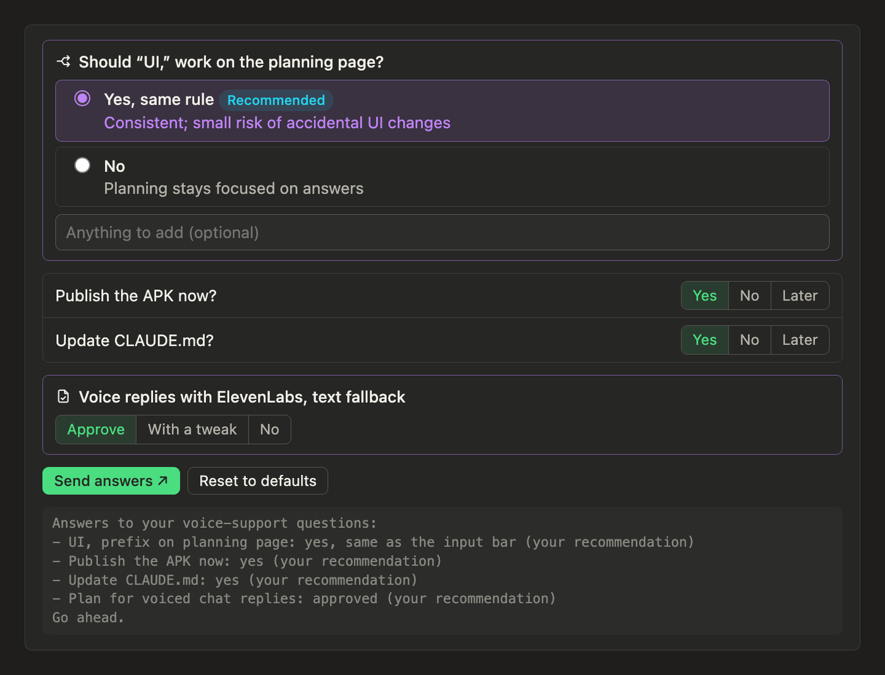</p>

### Test results and priorities

A device-test checklist whose ticks are reported back, reordering the next steps, and a free-text box.

<p align="center">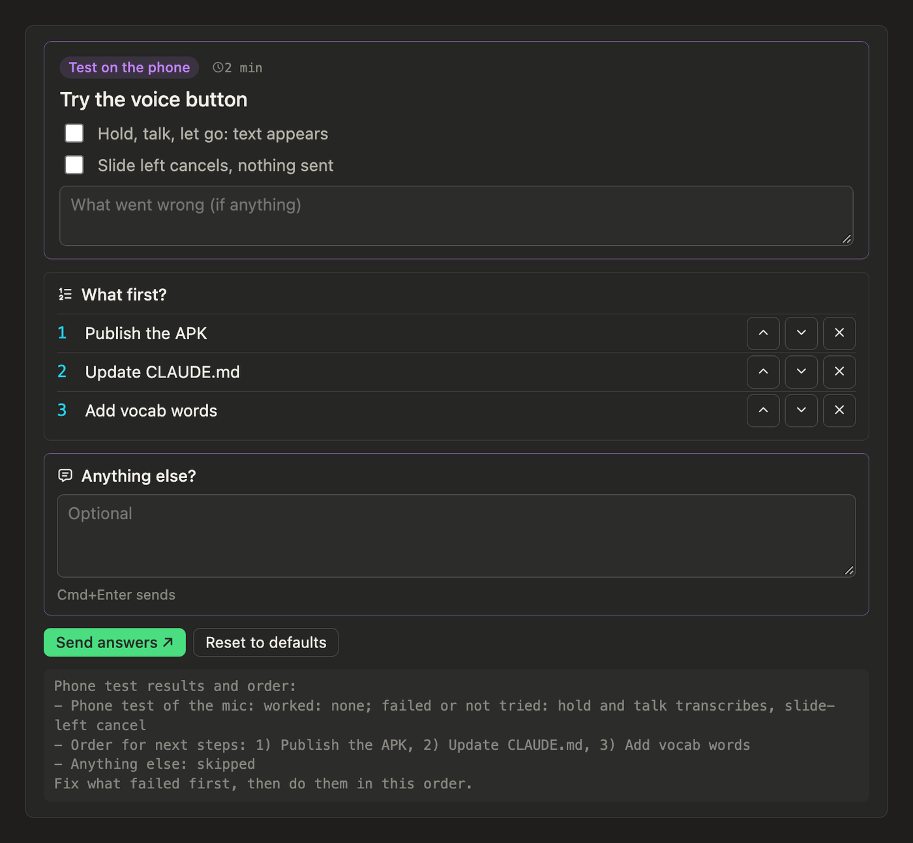</p>

### All done

Done, with the finished list folded away, a way to park or drop open threads, and ideas for later.

<p align="center">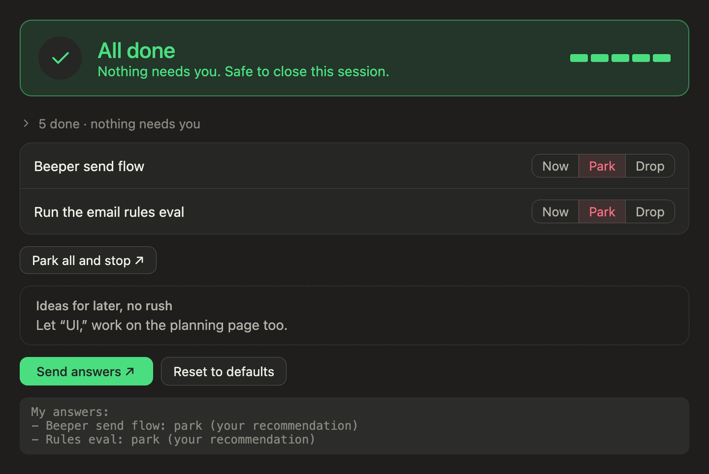</p>

## Honest by design

The skill has firm rules against overclaiming:

- Green needs evidence from this session.
- "Not run" and "stale" are shown, never left out.
- Red is only for something seen failing.
- "Builds" never stands in for "tests pass", and "deployed" never stands in for "installed".
- "All done" needs a clean slate.

## Settings

All optional, as environment variables:

| Variable | Effect |
|---|---|
| `SESSION_CARD_HOOK=0` | Turns off the stop hook that reminds Claude when a turn ends without a card |
| `SESSION_CARD_MIN_TOOLS=3` | Reminds only after turns with at least this many tool calls or a file edit (default 0: every turn) |
| `SESSION_CARD_TERMINAL=1` | Lets the hook nudge in a plain terminal session too (off by default) |

## How it works

The plugin has two parts:

- **A skill** (`skills/session-card/SKILL.md`). It tells Claude when and how to draw a card, describes every block, and sets the honesty rules.
- **A stop hook** (`hooks/stop.py`). If a turn ends without a card in a desktop or mobile session, it nudges Claude once.

To draw a card, Claude writes a short JSON spec and passes it to the `show_widget` tool, together with a renderer loaded from this repo through jsDelivr:

```html
<div id="sc"></div>
<script src="https://cdn.jsdelivr.net/gh/timoconnellaus/session-card@v1.7.2/renderer.js" integrity="…" crossorigin="anonymous"></script>
<script>SessionCard.render('#sc', { title: "…", about: "…", blocks: [ … ] })</script>
```

The renderer is pinned to a version tag, with an integrity hash. Widgets can only load scripts from a few CDNs, which is why the renderer isn't self-hosted. Claude writes about 1 KB of JSON per card instead of a page of HTML.

## Developing

- `gallery/index.html` renders every example in `gallery/examples.js`, with buttons for dark mode and phone width. Serve the repo with any static server (`python3 -m http.server`) and open `/gallery/`. `?only=N` shows a single example with no page around it; the README images are taken that way.
- **To release:**
  1. Change `renderer.js` and bump `VERSION`.
  2. Commit and tag `vX.Y.Z`.
  3. In the skill, point the renderer URL at the new tag and update its `integrity` hash (`openssl dgst -sha384 -binary renderer.js | openssl base64 -A`).
  4. Bump `.claude-plugin/plugin.json`.
  5. Wait about 30 seconds before fetching the new tag from jsDelivr. A fetch that comes too early caches "file not found". If that happens, clear it with `curl https://purge.jsdelivr.net/gh/timoconnellaus/session-card@vX.Y.Z/renderer.js`, then check the hash matches.

  Old tags keep working, so cards drawn by older installs don't break.

## License

MIT
